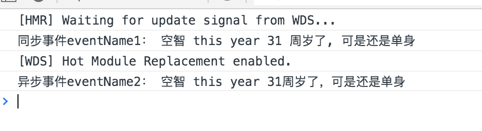
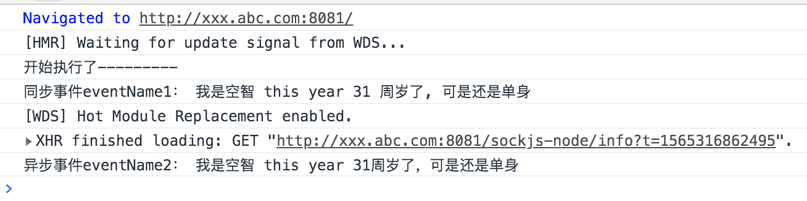
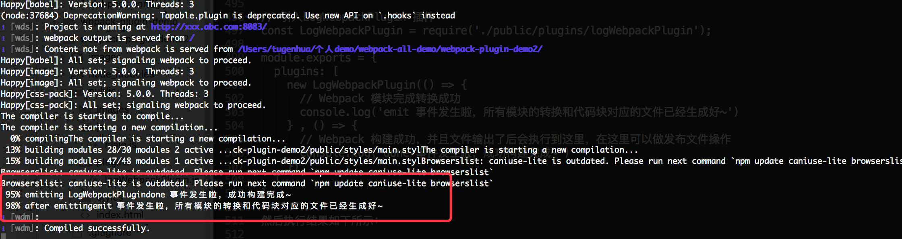
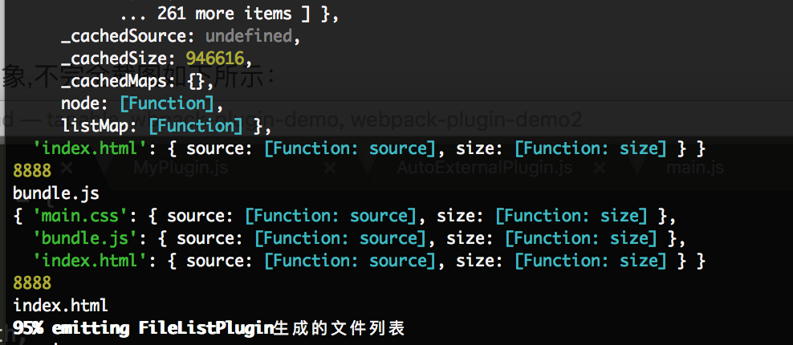
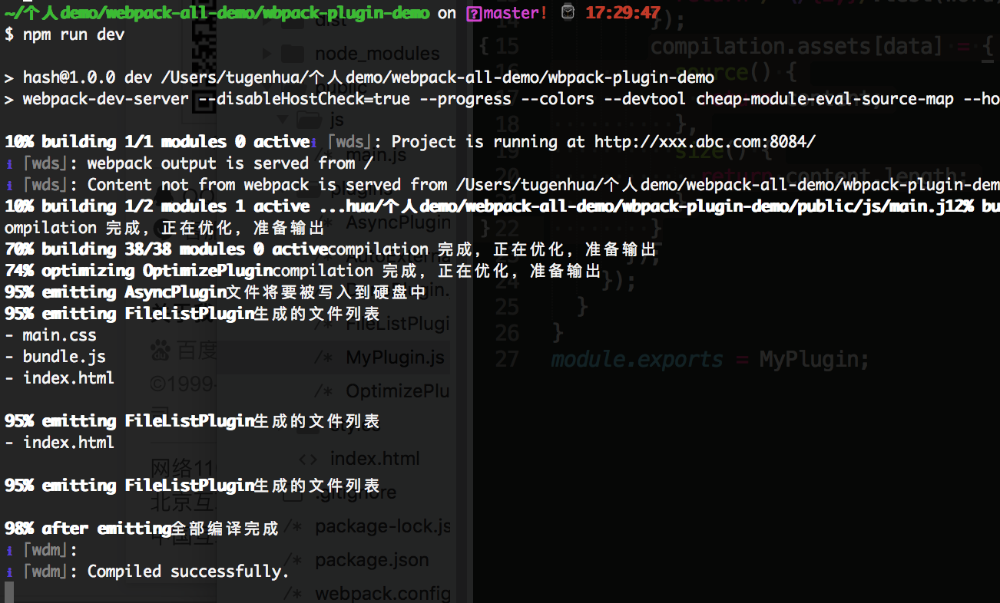

# Webpack原理浅析和实践

## 1. webpack插件的基本原理

webpack构建工具大家应该不陌生了，那么下面我们来简单的了解下什么是webpack的插件。比如我现在写了一个插件叫 `kongzhi-plugin` 这个插件。那么这个插件在处理webpack编译过程中会处理一些特定的任务。

比如我们现在在webpack.config.js 中引入了一个如下插件：

```js
// 引入打包html文件
const HtmlWebpackPlugin = require('html-webpack-plugin');
```
然后我们需要如下使用该插件：

```js
module.exports = {
  plugins: [
    new HtmlWebpackPlugin({
      template: './public/index.html' // 模版文件
    }),
  ]
};
```
如上就是一个 `HtmlWebpackPlugin` 插件 及在webpack中使用的方式了。现在我们需要实现一个类似的webpack的插件。

webpack打包是一种事件流的机制，它的原理是将各个插件串联起来。那么实现这一切的核心就是`tapable`，要想深入了解 `tapable`的知识可以看我之前的一篇文章.

`tapable`它可以暴露出挂载plugin的方法。可以让我们能将plugin控制在webpack事件流上运行。
tapable给我们暴露了很多钩子类，能为我们的插件提供挂载的钩子。

如下代码所示：

```js
const {
  SyncHook,
  SyncBailHook,
  SyncWaterfallHook,
  SyncLoopHook,
  AsyncParallelHook,
  AsyncParallelBailHook,
  AsyncSeriesHook,
  AsyncSeriesBailHook,
  AsyncSeriesWaterfallHook
} = require('tapable');
```
如上各个钩子的含义及使用方式，可以看我之前这篇文章的介绍。

下面我们来看个简单的demo，我们会定义一个 `KongZhiClass` 类，在内部我们创建一个 hooks 这个对象，然后在该对象上分别创建同步钩子`kzSyncHook`及异步钩子 `kzAsyncHook`。 然后分别执行，代码如下：

```js
const { SyncHook, AsyncParallelHook } = require('tapable');

// 创建类 

class KongZhiClass {
  constructor() {
    this.hooks = {
      kzSyncHook: new SyncHook(['name', 'age']),
      kzAsyncHook: new AsyncParallelHook(['name', 'age'])
    }
  }
}

// 实例化
const myName = new KongZhiClass();

// 绑定同步钩子， 用tap注册同步事件
myName.hooks.kzSyncHook.tap("eventName1", (name, age) => {
  console.log(`同步事件eventName1： ${name} this year ${age} 周岁了, 可是还是单身`);
});

// 绑定一个异步Promise钩子,用tapPromise 注册异步事件
myName.hooks.kzAsyncHook.tapPromise('eventName2', (name, age) => {
  return new Promise((resolve, reject) => {
    setTimeout(() => {
      console.log(`异步事件eventName2： ${name} this year ${age}周岁了，可是还是单身`);
    }, 1000);
  });
});

// 执行同步钩子
myName.hooks.kzSyncHook.call('空智', 31);

// 执行异步钩子
myName.hooks.kzAsyncHook.promise('空智', 31).then(() => {
  console.log('异步事件执行完毕');
}, (err) => {
  console.log('异步事件执行异常:' + err);
}) 
```
执行结果如下：



如上是我们使用的 `tapable` 的使用方式，现在我们需要使用`tapable`的demo来和我们的webpack的插件相关联起来，我们要如何做呢？

我们可以将上面的代码来拆分成两个文件：`compiler.js`、`plugin.js` （plugin.js 是入口文件）

假如我们的项目结构如下：

```bash
|--- tapable项目
| |--- node_modules  
| |--- public
| | |--- js
| | | |--- plugin.js
| | | |--- compiler.js
| |--- package.json
| |--- webpack.config.js
```
`compiler.js` 需要做的事情如下：

1. 定义一个 Compiler 类，接收一个options对象参数，该参数是从`plugin.js`中的MyPlugin类的实列对象。**该对象下有 apply函数**。

2. 在该类中我们定义了**run方法**，我们在`plugin.js` 中执行该`run`函数就可以自动执行对应的插件了。

代码如下：

```js
// compiler.js 模拟实现webpack的compiler
const { SyncHook, AsyncParallelHook } = require('tapable');

class Compiler {
  constructor(options) {
    this.hooks = { // hooks
      kzSyncHook: new SyncHook(['name', 'age']),
      kzAsyncHook: new AsyncParallelHook(['name', 'age'])
    };

    let plugins = options.plugins; // plugins,如果有，依次执行plugin.apply方法，将Compiler 作为参数传进去；
    if (plugins && plugins.length > 0) {
      plugins.forEach(plugin => plugin.apply(this));
    }
  }
  
  // 定义run方法
  run() {
    console.log('开始执行了---------');
    this.kzSyncHook('我是空智', 31);
    this.kzAsyncHook('我是空智', 31);
  }
  kzSyncHook(name, age) {
    this.hooks.kzSyncHook.call(name, age);
  }
  kzAsyncHook(name, age) {
    this.hooks.kzAsyncHook.callAsync(name, age);
  }
}

module.exports = Compiler;
```

`plugin.js` 需要做的事情如下：

1. 引入 `compiler.js` 文件。

2. 定义一个自己的插件，比如叫 `MyPlugin` 类，该类下有 apply 函数。该函数有一个 `compiler` 参数，该参数就是我们的 `compiler.js` 中的实列对象。然后我们会使用 `compiler` 实列对象去调用 `compiler.js` 里面的函数。因此就可以自动执行了。

代码如下所示：

```js
// plugin.js
const Compiler = require('./compiler');

// 定义一个Plugin
class MyPlugin {
  constructor() {
    
  }
  // 必须有apply方法，compiler是从require('./compiler')的实例对象，有Compiler的特性
  apply(compiler) {

    // 在hooks上添加同步hook:kzSyncHook 的事件监听，key为eventName1和回调
    compiler.hooks.kzSyncHook.tap("eventName1", (name, age) => {
      console.log(`同步事件eventName1： ${name} this year ${age} 周岁了, 可是还是单身`);
    });

  // 在hooks上添加异步hook:kzAsyncHook 的事件监听，key为eventName2和回调
    compiler.hooks.kzAsyncHook.tapAsync('eventName2', (name, age) => {
      setTimeout(() => {
        console.log(`异步事件eventName2： ${name} this year ${age}周岁了，可是还是单身`);
      }, 1000)
    });
  }
}

// 实例化MyPlugin 插件
const myPlugin = new MyPlugin();

const options = {
  plugins: [myPlugin]
};

// new一个Compiler 实例, 在new Compiler 的过程中，已经将myPlugin的钩子和对应的事件监听挂载了
const compiler = new Compiler(options);

// 开始执行myPlugin 的钩子实现
compiler.run();
```
最后执行的效果如下所示：



如上就是我们仿照`Compiler`和`webpack`的插件原理逻辑实现的一个简单demo。也就是说在webpack源码里面也是通过类似的方式来做的。

上面只是一个简单实现的基本原理，但是在我们的webpack当中我们要如何实现一个插件呢？
在我们的webpack官网中会介绍编写一个插件要满足如下条件, [官网地址](https://www.webpackjs.com/contribute/writing-a-plugin/)

从官网得知：编写一个webpack插件需要由以下组成：

> 1. 一个javascript命名**函数**。
>  2. 在插件函数的prototype上定义一个 **apply** 方法。
>  3. 指定一个绑定到webpack自身的**钩子函数**。
>  4. 处理webpack内部实列的特定数据(即内部逻辑处理)。
>  5. 功能完成后调用webpack提供的**回调函数**。

一个最基础的插件代码像如下这个样子：

```js
// 1.一个javascript命名函数
function MyExampleWebpackPlugin() {
  
};
// 2.在插件函数的prototype上定义一个 apply 方法
MyExampleWebpackPlugin.prototype.apply = function(compiler) {
  // 3.指定一个挂载到webpack自身的事件钩子。
  compiler.plugin('webpacksEventHook', function(compilation, callback){
    //4.内部逻辑处理
    console.log('这是一个插件demo');

    // 5.功能完成后调用 webpack 提供的回调
    callback();
  })
}

// 导出plugin
module.exports = MyExampleWebpackPlugin;
```
在我们使用该plugin的时候，相关调用及配置代码如下：

```js
const MyExampleWebpackPlugin = require('./MyExampleWebpackPlugin');
module.exports = {
  plugins: [
    new MyExampleWebpackPlugin(options)
  ]
};
```
webpack启动后，在读取配置的过程中：

- 先执行 `new MyExampleWebpackPlugin(options)` 初始化`MyExampleWebpackPlugin`来获得一个实列。然后我们会把该实列当做参数传递给我们的`Compiler`对象，
- 然后会实列化 `Compiler`类(这个逻辑可以结合看我们上面实现了一个简单的demo中 的`plugin.js`和`compiler.js`的代码结合起来理解)。在`Compiler`类中，我们会获取到`options`的这个参数，该参数是一个对象，该对象下有一个 `plugins` 这个属性。然后遍历该属性，然后依次执行 某项插件中的`apply`方法，即：`myExampleWebpackPlugin.apply(compiler)`; 给插件传递`compiler`对象(也就是`this`)。
- 插件实列获取该`compiler`对象后，就可以通过 `compiler.plugin('事件名称', '回调函数')`; 监听到webpack广播出来的事件.(这个地方我们可以看我们上面的`plugin.js`中的如下代码可以看到, 在我们的`plugin.js`代码中有这样代码：
```js
compiler.hooks.kzSyncHook.tap("eventName1", (name, age) => {}));
```
如上就是一个简单的Plugin的插件原理(切记：结合上面的demo中`plugin.js`和`compiler.js`来理解效果会更好)。


## 2. 理解 `Compiler`对象 和 `Compilation` 对象

在开发Plugin时我们最常用的两个对象就是 `Compiler` 和 `Compilation`, 他们是`Plugin`和`Webpack`之间的桥梁。

### 2.1 Compiler对象

Compiler 对象包含了Webpack环境所有的配置信息，包含`options`，`loaders`, `plugins`这些项，这个对象在webpack启动时候被实例化，它是全局唯一的。我们可以把它理解为webpack的实列。

基本源码可以看如下：

```js
// webpack/lib/webpack.js
const Compiler = require("./Compiler")

const webpack = (options, callback) => {
  ...
  // 初始化 webpack 各配置参数
  options = new WebpackOptionsDefaulter().process(options);

  // 初始化 compiler 对象，这里 options.context 为 process.cwd()
  let compiler = new Compiler(options.context);

  compiler.options = options // 往 compiler 添加初始化参数                               

  new NodeEnvironmentPlugin().apply(compiler)  // 往 compiler 添加 Node 环境相关方法

  for (const plugin of options.plugins) {
    plugin.apply(compiler);
  }
  ...
}
```
源码可以点击[这里](https://github.com/webpack/webpack/blob/10282ea20648b465caec6448849f24fc34e1ba3e/lib/webpack.js#L30)查看.  [官网可以看这里](https://webpack.docschina.org/api/compiler/)。

如上我们可以看到，`Compiler`对象包含了所有的`webpack`可配置的内容。开发插件时，我们可以从 `compiler` 对象中拿到所有和 webpack 主环境相关的内容。

### 2.2 Compilation 对象

`Compilation` 对象包含了当前的**模块资源、编译生成资源、文件的变化**等。当webpack在开发模式下运行时，每当检测到一个文件发生改变的时候，那么一次新的 `Compilation`将会被创建。从而生成一组新的编译资源。

Compiler对象 与 Compilation 对象 的区别是：**Compiler代表了是整个webpack从启动到关闭的生命周期。Compilation 对象只代表了一次新的编译**。

### 2.3 Compiler对象的事件钩子
我们可以看[官网](https://webpack.docschina.org/api/compiler/#%E4%BA%8B%E4%BB%B6%E9%92%A9%E5%AD%90). 或者我们也可以查看它的[源码](https://github.com/webpack/webpack/blob/eca7bad8de54c39b9cb8b138793362b8a17ac11b/lib/Compiler.js#L32)也可以看得到

我们可以了解常见的事件钩子：下面是一些比较常见的事件钩子及作用：

```bash
钩子               作用                     参数               类型
after-plugins     设置完一组初始化插件之后    compiler          sync
after-resolvers   设置完 resolvers 之后     compiler          sync
run               在读取记录之前             compiler          async
compile           在创建新 compilation之前  compilationParams  sync
compilation       compilation 创建完成      compilation        sync
emit              在生成资源并输出到目录之前  compilation        async
after-emit        在生成资源并输出到目录之后  compilation        async
done              完成编译                  stats              sync
```

### 2.4 理解webpack中的事件流

我们可以把webpack理解为**一条生产线**，需要经过一系列处理流程后才能将源文件转换成输出结果。
这条生产线上的每个处理流程的**职责都是单一**的，多个流程之间会存在依赖关系，只有完成当前处理后才能交给下一个流程去处理。

我们的插件就像一个插入到生产线中的一个功能，在特定的时机对生产线上的资源会做处理。webpack它是通过 `Tapable`来组织这条复杂的生产线的。

webpack在运行的过程中会**广播事件**，插件只需要关心监听它的事件，就能加入到这条生产线中。然后会执行相关的操作。

webpack的事件流机制它能保证了插件的有序性，使整个系统的扩展性好。**事件流机制**使用了观察者模式来实现的。比如如下代码：

```js
/*
 * 广播事件
 * myPlugin-name 为事件名称
 * params 为附带的参数
*/

compiler.apply('myPlugin-name', params);

/*
 * 监听名称为 'myPlugin-name' 的事件，当 myPlugin-name 事件发生时，函数就会执行。
*/

compiler.hooks.myPlugin-name.tap('myPlugin-name', function(params) {
  
});
```

## 3. 插件中常用的API

### 3.1 读取输出资源、模块及依赖

在我们的`emit`钩子事件发生时，表示的含义是：源文件的转换和组装已经完成了，在这里事件钩子里面我们可以读取到最终将**输出的资源、代码块、模块及对应的依赖文件**。并且我们还可以输出资源文件的内容。比如插件代码如下：

```js
class MyPlugin {
  apply(compiler) {
    compiler.plugin('emit', function(compilation, callback) {
      // compilation.chunks 是存放了所有的代码块，是一个数组，我们需要遍历
      compilation.chunks.forEach(function(chunk) {
        /*
         * chunk 代表一个代码块，代码块它是由多个模块组成的。
         * 我们可以通过 chunk.forEachModule 能读取组成代码块的每个模块
        */
        chunk.forEachModule(function(module) {
          // module 代表一个模块。
          // module.fileDependencies 存放当前模块的所有依赖的文件路径，它是一个数组
          module.fileDependencies.forEach(function(filepath) {
            console.log(filepath);
          });
        });
        /*
         webpack 会根据chunk去生成输出的文件资源，每个chunk都对应一个及以上的输出文件。
         比如在 Chunk中包含了css 模块并且使用了 ExtractTextPlugin 时，
         那么该Chunk 就会生成 .js 和 .css 两个文件
        */
        chunk.files.forEach(function(filename) {
          // compilation.assets 是存放当前所有即将输出的资源。
          // 调用一个输出资源的 source() 方法能获取到输出资源的内容
          const source = compilation.assets[filename].source();
        });
      });
      /*
       该事件是异步事件，因此要调用 callback 来通知本次的 webpack事件监听结束。
       如果我们没有调用callback(); 那么webpack就会一直卡在这里不会往后执行。
      */
      callback();
    })
  }
}
```
### 3.2 监听文件变化

webpack读取文件的时候，它会从入口模块去读取，然后依次找出所有的依赖模块。当入口模块或依赖的模块发生改变的时候，那么就会触发一次新的 Compilation。

在我们开发插件的时候，我们需要知道是那个文件发生改变，导致了新的Compilation, 我们可以添加如下代码进行监听。

```js
// 当依赖的文件发生改变的时候 会触发 watch-run 事件

class MyPlugin {
  apply(compiler) {
    compiler.plugin('watch-run', (watching, callback) => {
      // 获取发生变换的文件列表
      const changedFiles = watching.compiler.watchFileSystem.watcher.mtimes;
      // changedFiles 格式为键值对的形式，当键为发生变化的文件路径
      if (changedFiles[filePath] !== undefined) {
        // 对应的文件就发生了变化了
      }
      callback();
    });

    /*
     默认情况下Webpack只会监听入口文件或其依赖的模块是否发生变化，但是在有些情况下比如html文件发生改变的时候，那么webpack
     就会去监听html文件的变化。因此就不会重新触发新的 Compilation。因此为了监听html文件的变化，我们需要把html文件加入到
     依赖列表中。因此我们需要添加如下代码：
    */
    compiler.plugin('after-compile', (compilation, callback) => {
      /*
       如下的参数filePath是html文件路径，我们把HTML文件添加到文件依赖表中，然后我们的webpack会去监听html模块文件，
       html模板文件发生改变的时候，会重新启动下重新编译一个新的 Compilation.
      */
      compilation.fileDependencies.push(filePath);
      callback();
    })
  }
}
```
### 3.3 修改输出资源

我们在第一点说过：在我们的`emit`钩子事件发生时，表示的含义是：源文件的转换和组装已经完成了，在这里事件钩子里面我们可以读取到最终将输出的资源、代码块、模块及对应的依赖文件。因此如果我们现在要修改输出资源的内容的话，我们可以在`emit`事件中去做修改。那么所有输出的资源会存放在 `compilation.assets`中，`compilation.assets`是一个键值对，键为需要输出的文件名，值为文件对应的内容。如下代码：

```js
class MyPlugin {
  apply(compiler) {

    // 设置compilation.assets 代码如下：
    compiler.plugin('emit', (compilation, callback) => {
      
      // 设置名称为 fileName 的输出资源
      compilation.assets[fileName] = {
        // 返回文件内容
        source: () => {
          // fileContent 即可以代表文本文件的字符串，也可以是代表二进制文件的buffer
          return fileContent;
        },
        // 返回文件大小
        size: () => {
          return Buffer.byteLength(fileContent, 'utf8');
        }
      };
      callback();
    });

    // 读取 compilation.assets 代码如下：
    compiler.plugin('emit', (compilation, callback) => {
      
      // 读取名称为 fileName 的输出资源
      const asset = compilation.assets[fileName];
      // 获取输出资源的内容
      asset.source();
      // 获取输出资源的文件大小
      asset.size();
      callback();
    });
  }
}
```
### 3.4 判断webpack使用了哪些插件

在我们开发一个插件的时候，我们需要根据当前配置是否使用了其他某个插件，我们可以通过读取webpack某个插件配置的情况，比如来判断我们当前是否使用了 `HtmlWebpackPlugin` 插件。代码如下：

```js
/*
 判断当前配置使用了 HtmlWebpackPlugin 插件。
 compiler参数即为 webpack 在 apply(compiler) 中传入的参数
*/

function hasHtmlWebpackPlugin(compiler) {
  // 获取当前配置下所有的插件列表
  const plugins = compiler.options.plugins;
  // 去plugins中寻找有没有 HtmlWebpackPlugin 的实列
  return plugins.find(plugin => plugin.__proto__.constructor === HtmlWebpackPlugin) !== null;
}
```

## 4. 编写插件实战

 假如现在我们的项目的目录结构如下：

```
|--- webpack-plugin-demo
| |--- node_modules
| |--- js
| | |--- main.js               # js 的入口文件
| |--- plugins
| | |--- logWebpackPlugin.js   # 编写的webpack的插件，主要作用是打印日志功能
| |--- styles
| |--- index.html
| |--- package.json
| |--- webpack.config.js
```
### 4.1 日志插件`LogWebpackPlugin`

实现一个打印日志的`LogWebpackPlugin`插件

代码如下：

```js
class LogWebpackPlugin {
  constructor(emitCallback, doneCallback) {
    this.emitCallback = emitCallback
    this.doneCallback = doneCallback
  }
  apply(compiler) {

    compiler.hooks.emit.tap('LogWebpackPlugin', () => {
      // 在emit 事件钩子中回调 emitCallback, 在生成资源并输出到目录之前
      this.emitCallback();
    });

    compiler.hooks.done.tap('LogWebpackPlugin', (err) => {
      // 在done事件钩子中回调 doneCallback,完成编译
      this.doneCallback();
    });

    compiler.hooks.compilation.tap('LogWebpackPlugin', () => {
      // compilation（编译器对'编译ing'这个事件的监听）.compilation 创建完成
      console.log("The compiler is starting a new compilation...")
    });

    compiler.hooks.compile.tap('LogWebpackPlugin', () => {
      // compile（编译器对'开始编译'这个事件的监听）, 在创建新 compilation 之前
      console.log("The compiler is starting to compile...")
    });
  }
}

// 导出插件
module.exports = LogWebpackPlugin;
```


下面我们在webpack中引入该插件；如下代码：

```js
// 引入LogWebpackPlugin 插件
const LogWebpackPlugin = require('./public/plugins/logWebpackPlugin');

module.exports = {
  plugins: [
    new LogWebpackPlugin(() => {
      // Webpack 模块完成转换成功
      console.log('emit 事件发生啦，所有模块的转换和代码块对应的文件已经生成好~')
    } , () => {
      // Webpack 构建成功，并且文件输出了后会执行到这里，在这里可以做发布文件操作
      console.log('done 事件发生啦，成功构建完成~')
    })
  ]
}
```
然后执行结果如下所示：



可以看到我们执行成功了，执行了对应的回调函数。如上代码中的 `compiler` 这个我这边就不讲解了，上面已经讲过了。那么 `compiler.hooks` 代表的是对外 暴露了多少事件钩子，具体那个钩子是什么含义，我们可以来看下[官网](https://webpack.docschina.org/api/compiler/#%E4%BA%8B%E4%BB%B6%E9%92%A9%E5%AD%90)

如上面代码，我们使用两个钩子事件，分别是 `compiler.hooks.emit` 和 `compiler.hooks.done`, 

- `compiler.hooks.emit` 钩子事件的含义是: 在生成资源并输出到目录之前。这个事件就会发生。 
- `compiler.hooks.done` 的含义是：编译完成，该事件就会发生。

因此上面截图我们可以看到先触发 `emit`事件，因此会打印"emit 事件发生啦，所有模块的转换和代码块对应的文件已经生成好~" , 然后会触发 done事件，因此会打印 'done 事件发生啦，成功构建完成~' 执行这个回调函数。

### 4.2 编写一个去除注释的插件

编写去除生成 bundle.js 中多余的注释的插件

项目结构如下：

```bash
|--- webpack-plugin-demo
| |--- node_modules
| |--- public
| | |--- js
| | | |--- main.js                     # 入口文件             
| | |--- plugins                       # 存放所有的webpack插件
| | | |--- AsyncPlugin.js 
| | | |--- AutoExternalPlugin.js
| | | |--- DonePlugin.js
| | | |--- FileListPlugin.js
| | | |--- MyPlugin.js
| | | |--- OptimizePlugin.js
| | |--- styles                        # 存放css样式文件
| | |--- index.html                    # index.html模板
| |--- package.json        
| |--- webpack.config.js 
```

项目结构如上所示；上面在 `public/plugins` 中一共有6个插件，我们分别来看下6个插件的代码，加深一下原理：

1. `public/plugins/AsyncPlugin.js `

代码如下：

```js
class AsyncPlugin {
  constructor() {

  }
  apply(compiler) {
    // 监听emit事件，编译完成后，文件内容输出到硬盘上 触发该事件
    compiler.hooks.emit.tapAsync('AsyncPlugin', (compilation, callback) => {
      setTimeout(() => {
        console.log('文件将要被写入到硬盘中');
        callback();
      }, 2000)
    })
  }
}

module.exports = AsyncPlugin;
```
如上该插件代码没有什么实际作用，无非就是监听 `emit` 异步事件钩子，emit事件钩子我们从官网上可以看到具体的含义为：'在生成资源并输出到目录之前',会执行该事件钩子中函数代码，这边无非就是在控制台中打印一些提示信息的，没有什么实际作用的。

2. `public/plugins/DonePlugin.js` 

代码如下：
```js
class DonePlugin {
  constructor() {

  }
  apply(compiler) {
    compiler.hooks.done.tapAsync('DonePlugin', (name, callback) => {
      console.log('全部编译完成');
      callback();
    })
  }
}

module.exports = DonePlugin;
```
如上代码也是一个意思，当编译完成后，就会执行 done的事件钩子的回调函数，也是在命令中提示作用的。

3. `public/plugins/OptimizePlugin.js` 

代码如下：

```js
class OptimizePlugin {
  constructor() {

  }
  apply(compiler) {
    // 监听 compilation 事件
    compiler.hooks.compilation.tap('OptimizePlugin', (compilation) => {
      compilation.hooks.optimize.tap('OptimizePlugin', () => {
        console.log('compilation 完成，正在优化，准备输出');
      });
    });
  }
}

module.exports = OptimizePlugin;
```
也是一样监听 `compilation` 事件的，每当检测到一个文件发生改变的时候，那么一次新的 Compilation将会被创建。从而生成一组新的编译资源。

4. `public/plugins/FileListPlugin.js`

代码如下：

```js
class FileListPlugin {
  constructor() {

  }
  apply(compiler) {
    compiler.hooks.compilation.tap('FileListPlugin', (compilation) => {
      compiler.hooks.emit.tap('FileListPlugin', () => {
        let content = '生成的文件列表\r\n';
        content = Object.keys(compilation.assets).reduce((current, prev) => current + '- ' + prev + '\r\n', content);
        console.log(content);
        compilation.assets['README.md'] = {
          source() {
            return content;
          },
          size() {
            return content.length;
          }
        }
      })
    })
  }
}
module.exports = FileListPlugin;
```
生成文件列表的时候，就会触发该文件的代码。

5. `public/plugins/AutoExternalPlugin.js` 

代码如下：

```js
const ExternalModules = require('webpack/lib/ExternalModule');

class AutoExternalPlugin {
  constructor(options) {
    this.options = options;
    this.externalModules = {};
  }
  apply(compiler) {
    compiler.hooks.normalModuleFactory.tap('AutoExternalPlugin', (normalModuleFactory) => {
      // parser 将代码转换为语法书 判断有无 import
      normalModuleFactory.hooks.parser.for('javascript/auto').tap('AutoExternalPlugin', (parser, parserOptions) => {
        parser.hooks.import.tap('AutoExternalPlugin', (statement, source) => {
          if (this.options[source]) {
            this.externalModules[source] = true;
          }
        })
      })
      // factory 是创建模块的方法
      // data 是创建模块的参数
      normalModuleFactory.hooks.factory.tap('AutoExternalPlugin', factory => (data, callback) => {
        const dependencies = data.dependencies;
        const value = dependencies[0].request; // jquery
        if (this.externalModules[value]) {
          const varName = this.options[value].varName;
          callback(null, new ExternalModules(varName, 'window'));
        } else {
          factory(data, callback);
        }
      })
    });
    compiler.hooks.compilation.tap('InlinePlugin', (compilation) => {
      compilation.hooks.htmlWebpackPluginAlterAssetTags.tapAsync('AutoExternalPlugin', (htmlPluginData, callback) => {
        Object.keys(this.options).forEach(key => {
          this.externalModules[key] = this.options[key];
          htmlPluginData.body.unshift(this.processTags(compilation, htmlPluginData, this.options[key]))
        });
        callback(null, htmlPluginData); 
      });
    });
  }
  processTags(compilation, htmlPluginData, value) {
    var tag;
    return tag = {
      tagName: 'script',
      closeTag: true,
      attributes: {
        type: 'text/javascript',
        src: value.url
      }
    }
  }
}

module.exports = AutoExternalPlugin;
```
如上该插件的代码的作用是可以解决外部的js引用，比如我在webpack中如下使用该插件：

```js
const AutoExternalPlugin = require('./public/plugins/AutoExternalPlugin');
module.exports = {
  plugins:[
    new AutoExternalPlugin({
      jquery:{
        varName:'jQuery',
        url: 'https://cdn.bootcss.com/jquery/3.1.0/jquery.js'
      }
    })
  ]
}
```
这样我就可以在页面中使用jquery插件了；如下代码所示：
```js
import $ from 'jquery';
console.log($);
```
然后在我们的页面中引入的是 该 jquery库文件，它会把该库文件自动生成到 `index.html `上去，如下`index.html` 代码变成如下了：

```html
<html lang="en">
<head>
  <meta charset="UTF-8">
  <title></title>
  <link rel="manifest" href="/public/manifest.json" />
<link href="main.css" rel="stylesheet"></head>
<body>
  <div id="app">222226666</div>
<script type="text/javascript" src="https://cdn.bootcss.com/jquery/3.1.0/jquery.js"></script><script type="text/javascript" src="bundle.js"></script></body>
</html>
```
我们可以来简单的分析下 `AutoExternalPlugin.js` 的代码：

在apply方法内部会生成一个 compiler 实列，然后我们监听 `normalModuleFactory` 事件，该事件的作用我们可以看下官网就知道了。

```js
compiler.hooks.normalModuleFactory.tap('AutoExternalPlugin', (normalModuleFactory) => {
  // parser 将代码转换为语法书 判断有无 import
  normalModuleFactory.hooks.parser.for('javascript/auto').tap('AutoExternalPlugin', (parser, parserOptions) => {
    parser.hooks.import.tap('AutoExternalPlugin', (statement, source) => {
      if (this.options[source]) {
        this.externalModules[source] = true;
      }
    })
  })
}
```
如上 parser 实例，是用来解析由 webpack 处理过的每个模块。parser 也是扩展自 tapable 的 webpack 类，并且提供多种 tapable 钩子，插件作者可以使用它来自定义解析过程。[官网解释可以看这里](https://webpack.docschina.org/api/parser/)

如上代码，我们调用 `parser.hooks.import` 钩子函数， 然后返回的 source 就是我们的在 我们的`main.js` 中调用插件名。如`main.js` 代码如下：
```js
import $ from 'jquery';
```
因此在我们的webpack.config.js 中会如下初始化插件 

```js
new AutoExternalPlugin({
  jquery:{
    varName:'jQuery',
    url: 'https://cdn.bootcss.com/jquery/3.1.0/jquery.js'
  }
});
```
因此 source 返回的值 就是 'jquery'; 其他的代码可以自己稍微看看就行了。这里暂时先不讲了，由于时间问题。

6. `public/plugins/MyPlugin.js`

代码如下：

```js
class MyPlugin {
  constructor(options) {
    this.options = options;
    this.externalModules = {};
  }
  apply(compiler) {
    var reg = /("([^\\\"]*(\\.)?)*")|('([^\\\']*(\\.)?)*')|(\/{2,}.*?(\r|\n))|(\/\*(\n|.)*?\*\/)|(\/\*\*\*\*\*\*\/)/g;
    compiler.hooks.emit.tap('CodeBeautify', (compilation) => {
      Object.keys(compilation.assets).forEach((data) => {
        console.log(data);
        let content = compilation.assets[data].source(); // 获取处理的文本
        content = content.replace(reg, function (word) { // 去除注释后的文本
          return /^\/{2,}/.test(word) || /^\/\*!/.test(word) || /^\/\*{3,}\//.test(word) ? "" : word;
        });
        compilation.assets[data] = {
          source() {
            return content;
          },
          size() {
            return content.length;
          }
        }
      });
    });
  }
}
module.exports = MyPlugin;
```
这个js代码的真正的含义才是我们今天要讲到的，这个插件最主要作用是 去除注释后的文本。

1. 第一步，我们使用 `compiler.hooks.emit` 钩子函数。在生成资源并输出到目录之前触发该函数，也就是说将编译好的代码发射到指定的stream中就会触发，然后我们从回调函数返回的 compilation 对象上可以拿到编译好的 stream.

2. 访问compilation对象，compilation内部会返回很多内部对象，这边先不打印了，因为打印的话直接会卡死掉，要等很长时间才会打印出来，你们自己可以试试；然后我们遍历 assets.
```js
Object.keys(compilation.assets).forEach((data) => {
  console.log(compilation.assets);
  console.log(8888)
  console.log(data);
});
```
如下图所示：



1. assets 数组对象中的key是资源名。在如上代码，我们通过 Object.key()方法拿到了。如下所示：
```bash
main.css
bundle.js
index.html
```
2. 然后我们调用 `compilation.assets[data].source()`; 可以获取资源的内容。

3. 使用正则，去掉注释，如下代码：

```js
Object.keys(compilation.assets).forEach((data) => {
  let content = compilation.assets[data].source(); // 获取处理的文本
  content = content.replace(reg, function (word) { // 去除注释后的文本
    return /^\/{2,}/.test(word) || /^\/\*!/.test(word) || /^\/\*{3,}\//.test(word) ? "" : word;
  });
});
```
4. 更新 `compilation.assets[data]` 对象，如下代码：

```js
compilation.assets[data] = {
  source() {
    return content;
  },
  size() {
    return content.length;
  }
}
```
然后我们就可以在webpack中引入该所有的插件：

```js
const DonePlugin = require('./public/plugins/DonePlugin');
const OptimizePlugin = require('./public/plugins/OptimizePlugin');
const AsyncPlugin = require('./public/plugins/AsyncPlugin');
const FileListPlugin = require('./public/plugins/FileListPlugin');
const AutoExternalPlugin = require('./public/plugins/AutoExternalPlugin');
const MyPlugin = require('./public/plugins/MyPlugin');
```
调用方式如下：

```js
module.exports = {
  plugins:[
    new DonePlugin(),
    new OptimizePlugin(),
    new AsyncPlugin(),
    new FileListPlugin(),
    new MyPlugin(),
    new AutoExternalPlugin({
      jquery:{
        varName:'jQuery',
        url: 'https://cdn.bootcss.com/jquery/3.1.0/jquery.js'
      }
    })
  ]
}
```
然后我们进行打包运行效果如下所示：

